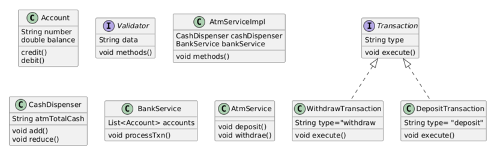

1. The ATM system should support basic operations such as balance inquiry, cash withdrawal, and cash deposit.
2. Users should be able to authenticate themselves using a card and a PIN (Personal Identification Number).
3. The system should interact with a bank's backend system to validate user accounts and perform transactions.
4. The ATM should have a cash dispenser to dispense cash to users.
5. The system should handle concurrent access and ensure data consistency.
6. The ATM should have a user-friendly interface for users to interact with.

Solution:

Using Chain of responsibility design pattern to design validator

### ATM works as finite state machine. we can use state design pattern in its implementations
#state interface ATMState

read_inserted_card
authenticate_pin
select_transaction
deposit_cash
invalid_cash_returned
enter_withdrawal_amount
cash_dispensed
display_balance
transact_again
exit
return_card

singleton pattern

State design: ATM, Vending machine, traffic signal, Order system
