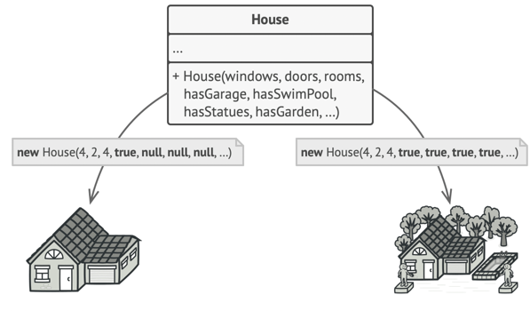

Builder patterns is introduced to create large and complex object setup by step.

## Problem:
Imagine a complex object that requires laborious, step-by-step initialization of many fields and nested objects.
Such initialization code is usually buried inside a monstrous constructor with lots of parameters.
Or even worse: scattered all over the client code.


if we have a class example house which is constructed by combining lots of subclasses like pool, backyard, ketchen and all.
Initialing house classes with constructor which accept huge set of parameters will be a problems in terms of code readability,
Also most of the time we do not need multiple subclasses to be initialised.
In most cases most of the parameters will be unused, making the constructor calls pretty ugly. For instance, only a fraction of houses have swimming pools,
so the parameters related to swimming pools will be useless nine times out of ten.
This pattern makes it easy to extend or modify the construction process without cluttering the House class with multiple constructors.



## Solution:

The Builder pattern suggests that you extract the object construction code out of its own class and move it to separate objects called builders.
```puml
housebuilder
buildPool()
buildRoof()
buildGarage()
buildWall()

```